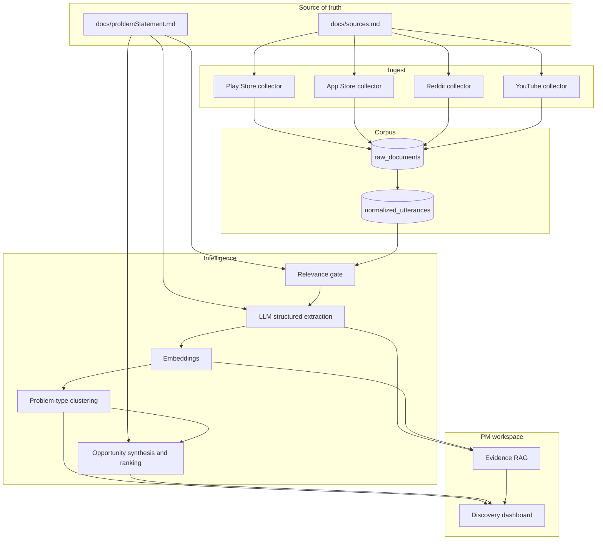
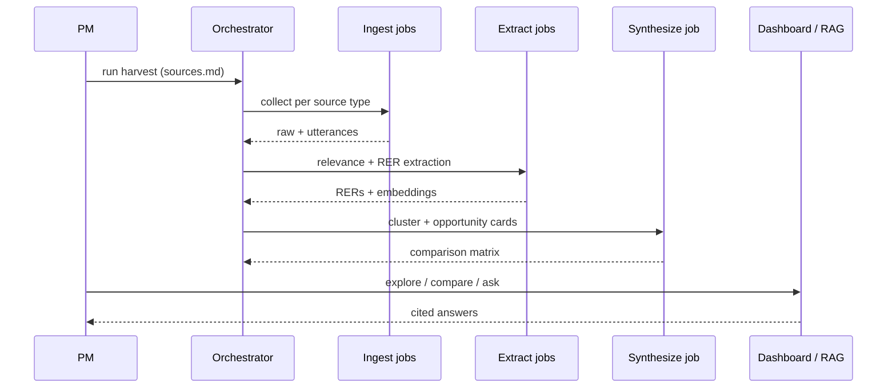

# Architecture: AI-powered discovery engine

This document specifies how **AI_Discovery** implements Part 1 of [`docs/problemStatement.md`](problemStatement.md): an AI system that analyzes public conversations about Google Photos retrieval at scale, then **identifies and compares retrieval problems and opportunity areas** with evidence.

It is **not** a Google Photos product architecture. It is the architecture of the **discovery engine** a Core Experience PM uses before proposing a solution.

Read [`docs/problemStatement.md`](problemStatement.md) and [`docs/sources.md`](sources.md) first. Ask before changing working definitions, evidence standards, or constraints.

Fetch URLs live only in [`docs/sources.md`](sources.md). Collectors must not invent extra store or discussion links unless they are added there.

**Implementation stack (constraints):** Python, Groq API, Streamlit, built in Cursor. The original brief allows any AI-native stack; this repo uses Groq for LLM jobs and Streamlit for the PM workspace.

---

## 1. Purpose and design constraints

### 1.1 Job of the system

Turn noisy public text (reviews, threads, comments) into a **comparable set of retrieval-problem types**, each with:

- what users remember vs forget
- how they try to search
- where the current experience breaks
- representative quotes and source links
- volume, severity, and distinctness vs other problem types

### 1.2 Quality bar (non-negotiable)

The engine **fails** if it only produces:

- star-rating charts
- positive / negative / mixed sentiment
- a single “users are unhappy with search” summary

The engine **succeeds** if a PM can open two problem types side by side and answer:

1. What kinds of old photos do users struggle to retrieve?
2. What information do people actually remember about a photo?
3. What information have they forgotten?
4. How do users formulate searches when memory is incomplete?

…and then **rank opportunity areas** using evidence, not intuition.

### 1.3 Scope

Incomplete-memory retrieval (brief definition): the user believes a specific photo/video/screenshot exists and tries to find it, but cannot supply a precise query. Counts: “I remember it but don’t know what to search.” Does **not** count: pure sync/deletion bugs, storage/pricing, or the user knew exactly what to type and the app failed.

| In this architecture | Explicitly out |
| --- | --- |
| Ingest public sources listed in `sources.md` | Scraping arbitrary URLs not in `sources.md` |
| Relevance filter for *incomplete-memory retrieval* | Building a new Photos search UI |
| Structured extraction of memory anchors, forgotten anchors, retrieval behaviors | Treating all Photo complaints as one bucket |
| Clustering, comparison, and evidence-backed ranking with quotes and counts | Private user libraries or Google-internal logs |
| RAG over evidence for follow-up PM questions | Improving ranking of the Photos search product itself |
| Confidence labels high / medium / low (keep broad evidence, weight it) | Claiming a success-rate or conversion impact from public stories |
| Pipeline diagram, schema, prompts, taxonomy, findings, prioritization, limitations | Storing usernames or author ids in the clear |

### 1.4 Evidence standards (from the brief)

- Every finding cites item ids and short quotes, with counts and the number of sources it appears in.
- Findings supported by fewer than ~5 items are labeled **weak signal**.
- Public data shows failure stories and workarounds, not rates. Never claim a success-rate impact.
- Known biases: frustrated users are over-represented; most Play Store reviews are about storage and pricing; few users describe what they remember; the first Reddit export was mostly off-topic and needs scoped re-runs.

### 1.5 Strategic north star (product vs engine)

- **Product success (later):** higher rate of successful retrieval when the user cannot describe the photo precisely.
- **Engine success (now):** distinct retrieval-problem types, compared with evidence, not a mixed sentiment dump.

---

## 2. High-level architecture

The system is a **batch + query** pipeline: collectors write a durable corpus; an analysis layer turns that corpus into problem types and opportunity areas; a PM workspace answers questions with citations.



**Control flow:** `sources.md` drives *what* is fetched. `problemStatement.md` drives *how* text is judged (retrieval under incomplete memory, not generic search quality).

---

## 3. Logical layers

### 3.1 Source registry

`docs/sources.md` is the only allowed harvest list. Each entry is typed so collectors use the right adapter:

| Source type | Role in the engine | Adapter |
| --- | --- | --- |
| Play Store listing | Android review stream | Store review API / listing review scrape of that ID only |
| App Store listing | iOS review stream | Store review API / listing review scrape of that ID only |
| Reddit search URL | Query scaffold: expand to result threads | Reddit search → thread IDs |
| Reddit thread URL | Primary discussion evidence | Thread + comments |
| YouTube video URL | How-to and complaint context | Video metadata + comments (and transcript if public) |

Store listings are **review streams**. Reddit searches are **scaffolds**. Threads are **primary evidence**. YouTube is **how-to / missing-photo / large-library context**. Mixing these types in one table is a data-quality bug.

### 3.2 Ingest adapters

Each adapter:

1. Reads its section of `sources.md` (or a generated `sources.yaml` compiled from it).
2. Fetches with rate limits, retries, and a harvest `run_id`.
3. Writes **immutable raw payloads** plus a thin envelope (URL, fetched_at, HTTP status, parser version).
4. Dedupes on a stable `source_item_id` (review id, Reddit fullname, YouTube comment id).

Adapters never rewrite history. Re-harvests append new versions; analysis always pins a `corpus_version`.

### 3.3 Normalize

Raw payloads differ by platform. Normalization produces **utterances**: one user-authored unit of text the rest of the pipeline can treat uniformly.

**Common schema (brief, required on every source):** `source`, `id`, `date`, `text`, `url`, `rating`, `country_or_subreddit`, `type`.

Additional harvest fields may exist for pipeline integrity; they must not reintroduce stored usernames or author ids.

| Field | Maps to / meaning |
| --- | --- |
| `source` | Platform origin (`play`, `app_store`, `reddit`, `youtube`) |
| `id` | Stable native or hashed item id (`utterance_id`) |
| `date` | Author timestamp if available |
| `text` | Title + body (user-authored) |
| `url` | Canonical URL from `sources.md` or a child URL from a listed search |
| `rating` | Stars if a store review; otherwise empty |
| `country_or_subreddit` | Store country if known, or subreddit name |
| `type` | `play_review` \| `app_store_review` \| `reddit_post` \| `reddit_comment` \| `youtube_comment` \| `youtube_transcript_segment` |
| `parent_source_url` | Listed URL that authorized this fetch |
| `harvest_run_id` | Which ingest produced this row |

Do **not** persist `author_handle` or author ids. Drop them, or hash if a join key is required, then store only the hash.

**Child-URL rule:** Reddit search URLs may expand to threads **not** listed in `sources.md`. Those children are allowed only if they appeared in a listed search result. They must store `parent_source_url` pointing at that search. Arbitrary subreddit crawls are not allowed. Exclude sensitive or unrelated subreddits (medical, mental health) from analysis even if a search returns them.

### 3.4 Relevance gate

Most store reviews are storage, backup, UI chrome, or billing. Those are **out of the retrieval brief** unless they also describe failed find/search.

The gate is a **two-stage filter**:

1. **Cheap lexical / embedding screen** against a retrieval lexicon (search, find, old photo, can’t remember, date, face, place, album, keyword, thousands of pictures, occasion, trip, screenshot, document, medicine, café, …).
2. **LLM gate** against the working definition: *Is this incomplete-memory retrieval?* (user believes the item exists, cannot supply a precise query). Output includes `confidence`: `high` | `medium` | `low` that the item is a true incomplete-memory case. Broad evidence is kept but weighted by this label.

Outputs:

- `relevance`: `in_scope` | `adjacent` | `out_of_scope`
- `confidence`: `high` | `medium` | `low` (incomplete-memory case)
- `relevance_rationale`
- `exclude_reason` (e.g. `storage_quota_only`, `editor_feature`, `crash_bug`, `precise_query_failed`, `sync_or_deletion_bug`)

Only `in_scope` and a small audited sample of `adjacent` enter extraction. `out_of_scope` stays in the corpus so the PM can audit false negatives. Weight downstream counts by confidence; do not drop `low` by default.

### 3.5 Structured extraction (the core differentiator)

Sentiment is an optional sidecar, never the primary schema. Each in-scope utterance is mapped to a **Retrieval Evidence Record (RER)**.

```text
RetrievalEvidenceRecord
  id                     # same as utterance id
  memory_anchors[]       # person, place, event/occasion, rough_time, purpose_context, emotion, visual_appearance, photo_type
  forgotten_anchors[]    # exact_date, location_name, album, keyword_filename
  retrieval_behaviors[]  # keyword_trial_and_error, scroll_timeline, search_by_person, search_by_place, ask_others_or_other_apps, give_up
  photo_type             # screenshot, document, receipt, medical, travel, kids, camera_photo, unknown
  failure_type           # hypothesis enum, see §5.1; data may add or reject
  search_formulation     # how they tried to query, if stated
  library_scale          # small | large | very_large | unknown
  user_goal              # find_one | browse_era | delete_old | prove_it_exists
  workaround             # what they did instead
  requested_capability   # what they asked the product to do
  confidence             # high | medium | low (true incomplete-memory case)
  quotes[]               # short spans copied verbatim from text
```

**Memory anchors (brief, closed list to start):** person, place, event/occasion, rough time, purpose/context (why it was taken), emotion, visual appearance, photo type (screenshot, document, receipt, medical, travel, kids).

**Forgotten anchors:** exact date, location name, album, keyword/filename.

**Retrieval behaviors:** keyword trial and error, scrolling the timeline, searching by person, searching by place, asking others or other apps, giving up.

Extraction must tag **remembered vs forgotten** separately. That split is the product insight the brief requires. Map older cue names (occasion, place_vague, …) onto this vocabulary; do not keep a second competing taxonomy.

### 3.6 Embeddings and clustering

RERs are embedded twice with **local BGE** (`BAAI/bge-small-en-v1.5`). The OpenAI embedding API is not used.

- **Text embedding** of `text` (for RAG and near-duplicate detection).
- **Structure embedding** of a canonical string built from `failure_type + photo_type + memory_anchors + forgotten_anchors + retrieval_behaviors` (for problem-type clustering).

Clustering (HDBSCAN or agglomerative over structure embeddings) yields **problem types**, not topics like “search” vs “backup”.

Suggested seed problem types (priors, not a closed list). Prefer the brief’s **starting hypotheses** first (§5.1); keep these only as extra clusters the data may support:

1. Incomplete-memory natural-language search (occasion / object / trip without keywords).
2. Date retrieval after UI change (cannot search by date).
3. Keyword search miss (query runs, target photo absent from results).
4. Large-album / large-library browse (10k+ items; find one shot in an album).
5. Face / place / people grouping as the only remembered cue.
6. Temporal neighborhood (“photos around this one”).
7. Existence doubt (backup vs device vs archive; “Photos not showing”) — **out of incomplete-memory** if it is only sync/deletion; adjacent unless memory is also incomplete.
8. Bulk triage of old photos (find-to-delete, not find-to-relive).

Human-in-the-loop: a PM (or analyst agent) **names** clusters and merges splits. Automatic labels are hypotheses.

### 3.7 Opportunity synthesis and comparison

For each problem type the synthesizer writes an **Opportunity Area Card**:

| Field | Purpose |
| --- | --- |
| `opportunity_id` | Stable slug |
| `problem_type_name` | Human label |
| `user_job` | Job-to-be-done in one sentence |
| `memory_profile` | What is remembered vs forgotten (aggregated) |
| `current_break` | Where retrieval fails in the existing experience |
| `who_is_hurt` | Platform, library scale, photo kinds |
| `evidence_count` | In-scope items; flag **weak signal** if fewer than ~5 |
| `source_spread` | Number of distinct sources (`source` / listing vs thread vs video) the finding appears in |
| `severity_score` | Composite: frequency × inability to workaround × library scale; **not** a success-rate claim |
| `distinctness` | How this differs from sibling opportunities |
| `counter_evidence` | Cases where current search already works |
| `open_questions` | What the engine still cannot answer |
| `limitations` | Biases and coverage gaps for this card |
| `citations[]` | `id` + URL + quote |

**Comparison** is a first-class output: a matrix of opportunities vs (memory anchors, retrieval behaviors, failure types, platforms, volume). Ranking is **relative**, never a single “top complaint.”

Sentiment may appear as a weak feature inside severity; it must not be the rank key.

### 3.8 Evidence RAG (follow-up questions)

The sample questions in the brief are not a closed list. The PM workspace exposes a retrieval-augmented Q&A path:

1. Embed the question.
2. Retrieve RERs + opportunity cards (hybrid: structure filters + vector).
3. Answer **only** with citations; refuse to generalize beyond retrieved evidence.
4. Log the question so repeated PM queries become new analysis jobs.

This is RAG over **the discovery corpus**, not over Google Photos’ image index.

### 3.9 PM workspace (presentation)

A local dashboard (recommended: Streamlit, given the project already has it in the environment) with:

- **Corpus health:** harvest runs, counts by source type, relevance mix.
- **Problem types:** cluster explorer with quote drawers.
- **Compare:** two or more opportunity cards + anchor/failure-type charts.
- **Ask:** RAG box grounded in RERs.
- **Export:** markdown brief for a later product-proposal phase.

No Photos client. No mock search UI for end users.

---

## 4. Data architecture

### 4.1 Stores

| Store | Contents | Suggested tech |
| --- | --- | --- |
| Object / file lake | Raw JSON responses, HTML snapshots | `data/raw/{source_type}/{run_id}/` |
| Relational | utterances, RERs, clusters, opportunities, harvest metadata | SQLite (local) → Postgres if shared |
| Vector | text + structure embeddings | Chroma or LanceDB (local-first) |
| Config | compiled source registry, taxonomies | `config/sources.yaml`, `config/taxonomy.yaml` |

Local-first is enough for Part 1. Cloud is optional later; it must not change the data contracts.

### 4.2 Corpus versioning

Every analysis job pins:

- `corpus_version` (hash of utterance ids + raw checksums)
- `taxonomy_version`
- `prompt_version` (extraction / relevance / synthesis)
- `model_id`

Re-running extraction without a new harvest is a **re-analysis**, not a new ingest.

### 4.3 Deduping and threading

- Store reviews: native review id.
- Reddit: `t3_` / `t1_` ids; comments inherit post `id` as `thread_id`.
- YouTube: `commentId`; optional transcript chunks keyed by video id + timestamp.
- Near-duplicates across platforms: MinHash / embedding similarity; keep both rows, link with `duplicate_group_id`. Cross-posting is evidence of intensity, not a delete.

---

## 5. Domain taxonomy

These enums are the shared language between extraction, clustering, and the dashboard. Extend via `config/taxonomy.yaml`; do not encode them only in prompts. Ask before changing definitions in the problem statement.

### 5.1 Starting hypotheses on failure types (to test, extend, or reject)

From the brief. These are **hypotheses only**. The data may add new types or reject these.

| Code | Meaning |
| --- | --- |
| `not_indexed_not_found` | Item seems absent from search / not indexed |
| `wrong_results` | Search returns the wrong items |
| `too_many_results` | Recall is too broad to scan |
| `cannot_express_query` | User cannot produce a precise query (core incomplete-memory) |
| `date_or_location_unknown` | Date or location was the missing precise cue |
| `photo_type_mismatch` | e.g. screenshot vs camera photo |
| `purpose_or_context_unsupported` | Search by why it was taken is unsupported |
| `other` | In narrative but unmatched; use to propose new types |

Former architecture codes (`query_vocabulary_gap`, `keyword_false_negative`, …) may map onto these hypotheses; do not run two competing failure-type lists.

### 5.2 Photo types (memory-anchor photo type)

`screenshot`, `document`, `receipt`, `medical`, `travel`, `kids`, `camera_photo`, `unknown`.

The brief’s examples map to `travel` (café / Goa) and `medical` / `document` (medicine when sick).

### 5.3 Relevance vs adjacent

- **In scope:** incomplete-memory retrieval as defined in the brief.
- **Adjacent:** find/search mentioned but the pain is storage, quality, editing, or a precise query that failed.
- **Out of scope:** crashes, Magic Eraser, pricing, sync/deletion-only missing photos, general “I hate the new tab” with no incomplete-memory story.

---

## 6. Runtime architecture (agents and jobs)

Prefer **explicit jobs** over a single chatty agent. Agents may orchestrate jobs; they must not skip the data contracts.



### 6.1 Job catalog

| Job | Trigger | Input | Output |
| --- | --- | --- | --- |
| `compile_sources` | Manual / CI | `sources.md` | `config/sources.yaml` |
| `harvest_*` | Manual or schedule | source entries | raw + utterances |
| `gate_relevance` | After harvest | utterances | relevance labels |
| `extract_rer` | After gate | in-scope utterances | RERs |
| `embed` | After extract | utterances + RERs | vector index |
| `cluster` | After embed | structure embeddings | problem types |
| `synthesize_opportunities` | After cluster | clusters + RERs | opportunity cards + matrix |
| `ask` | Interactive | question + index | cited answer |

### 6.2 Implementation stack (Part 1)

Constrained by the brief: **Python, Groq API, Streamlit, built in Cursor.**

| Concern | Choice | Why |
| --- | --- | --- |
| Language | Python 3.11+ | Collectors, Groq SDK, Streamlit |
| Orchestration | CLI jobs (`python -m discovery harvest`) | Debuggable, versionable |
| LLM | Groq API only (extraction + synthesis). Not OpenAI chat. | Brief constraint |
| Embeddings | Local BGE (`BAAI/bge-small-en-v1.5` via sentence-transformers). Not OpenAI embeddings. Not Groq nomic. | Locked in `config/models.yaml` |
| UI | Streamlit | Brief constraint; PM workspace |
| Secrets | `.env` (not committed) | Groq / Reddit / YouTube keys |

The original problem statement still allows Claude, GPTs, n8n, Zapier, Perplexity. Those are **not** the default in this repo. n8n/Zapier remain optional wrappers around the same jobs, not a second source of truth.

### 6.3 Suggested package layout

```text
AI_Discovery/
  docs/                 # problemStatement, sources, Architecture
  config/               # sources.yaml, taxonomy.yaml, prompts/
  src/discovery/
    ingest/             # play, appstore, reddit, youtube
    normalize/
    gate/
    extract/
    cluster/
    synthesize/
    rag/
  data/raw/
  data/processed/
  app/                  # Streamlit PM workspace
  tests/
```

---

## 7. Ingest design by source

All harvests honor robots/ToS, rate limits, and public-data-only. Prefer official APIs where they exist.

### 7.1 Google Play Store

- Target: listing `com.google.android.apps.photos` from `sources.md`.
- Capture: review text, rating, date, helpfulness, developer reply (reply is product context, not user memory).
- Filter later; do not pre-filter to 1-star only (retrieval pain appears in mixed reviews).

### 7.2 Apple App Store

- Target: app id `962194608`.
- Same utterance shape as Play so clustering is cross-platform.

### 7.3 Reddit

- **Searches:** execute listed queries; persist result rankings; enqueue new thread ids with `parent_source_url`.
- **Threads:** listed thread URLs are mandatory harvests even if they never appear in a search page.
- Keep post + comments; extraction runs per utterance but clustering can weight posts higher than drive-by comments.
- Drop search hits from medical or mental-health subreddits; do not send them to analysis.

### 7.4 YouTube

- Listed video ids only (plus comments on those videos).
- Transcripts (if available) describe **workarounds and mental models** (face grouping, backup vs gallery, “search natural language”). Treat creator speech as **secondary** to commenters unless the creator is narrating a retrieval failure.

### 7.5 Failure and fairness

- Partial harvests are valid: mark `harvest_status` per source entry (`ok`, `blocked`, `empty`, `error`).
- Blocked sources must surface in the dashboard so the PM does not assume silence = no problem.

---

## 8. LLM prompt architecture

Prompts are versioned files, not chat history.

| Prompt | Input | Output JSON |
| --- | --- | --- |
| `relevance_vN` | utterance + incomplete-memory definition | relevance enum + `high`/`medium`/`low` + rationale |
| `extract_rer_vN` | utterance + taxonomy | RER |
| `name_cluster_vN` | sample quotes + memory-anchor histograms | label + distinction vs neighbors |
| `opportunity_card_vN` | cluster aggregate + quotes | opportunity card |
| `compare_vN` | two or more cards | comparison narrative + matrix deltas |
| `ask_vN` | question + retrieved chunks | answer with citation ids only |

**Guardrails:**

- Copy quotes verbatim; never paraphrase inside `quotes[]`.
- If memory or forgotten anchors are not in the text, use `unknown` — do not invent a Goa café story.
- If the text is generic “search sucks,” force `failure_type = other` and `confidence = low` rather than mapping to incomplete-memory.

---

## 9. Ranking and comparison math

Severity is a **transparent formula**, shown in the UI. It ranks **story volume and pain**, not product success rate. Never present it as a retrieval-rate impact.

```text
severity = w1 * log(1 + evidence_count)
         + w2 * share_with_no_workaround
         + w3 * share_very_large_library
         + w4 * share_forgotten_precise_anchors
         - w5 * share_counter_evidence
```

Weight evidence by confidence (`high` > `medium` > `low`). Label any finding with fewer than ~5 supporting items **weak signal**. Report **source_spread** (how many sources the pattern appears in) next to counts.

Weights live in config. Do not hide them inside a model.

**Distinctness:** Jaccard distance on memory-anchor sets + failure-type distribution. If two clusters share > threshold anchors and type, the synthesizer must propose a merge.

**Comparison views:**

- Anchor heatmap: remembered vs forgotten by opportunity.
- Behavior funnel: how users search vs where they fail.
- Platform split: Play vs App Store vs Reddit (Reddit is richer narrative; stores are higher volume).
- Photo-type mix: medical/documents vs travel vs kids vs screenshots.

---

## 10. PM workspace UX (information architecture)

1. **Overview** — in-scope volume, harvest freshness, top failure types (not average stars).
2. **Evidence explorer** — filters: source, type, photo type, memory anchor, forgotten anchor, failure type, retrieval behavior, confidence, library scale.
3. **Problem types** — cluster cards; click through to utterances.
4. **Opportunities** — ranked table; open a card; pin two for **Compare**.
5. **Ask the corpus** — RAG with citation list and “not enough evidence” empty state.
6. **Audit** — out-of-scope samples, low-confidence RERs, blocked sources.

Empty states must say **no evidence in corpus**, never **users don’t have this problem**.

---

## 11. Security, ethics, and compliance

- Public content only; no login to private Google accounts, no user photo libraries.
- **Privacy:** drop or hash usernames and author ids; store only text, date, source, URL (plus the common schema fields `id`, `rating`, `country_or_subreddit`, `type`). Do not keep emails from review signatures.
- Exclude sensitive or unrelated subreddits (medical, mental health) from analysis.
- Respect API quotas; cache raw responses to avoid re-hitting stores.
- Secrets in environment variables; `env` / `.env` never committed with keys.
- Quotes in exports must keep original URLs for attribution; cite item `id`.
- Outputs are **research artifacts** (failure stories and workarounds). Never claim a success-rate impact or private Photos telemetry.

---

## 12. Quality assurance

| Test | What it proves |
| --- | --- |
| Source compiler | Every URL in `sources.md` becomes a typed registry row |
| Adapter contract | Harvest envelope always has `parent_source_url` |
| Relevance gold set | Hand-labeled slice (in / adjacent / out) vs gate |
| Extraction gold set | Brief examples (café/Goa, medicine/sick) map to memory anchors and photo types |
| Confidence labels | Items get high / medium / low incomplete-memory confidence |
| Weak signal | Findings with fewer than ~5 items are labeled weak signal |
| No-sentiment unit | Pipeline output still meaningful if `sentiment` field is dropped |
| Citation integrity | Every quote span is a substring of `text` |
| Compare job | Two opportunities produce a matrix, not a merged blurb; counts + source_spread |
| No rate claims | Exports do not state success-rate impact |
| RAG abstain | Unrelated question returns insufficient evidence |
| Privacy | No plaintext username or author id in processed tables |

Gold sets live in `tests/gold/` as JSONL.

---

## 13. Non-goals and Part 1 done when

**Part 1 (this architecture):** discover and compare retrieval problems with public evidence.

**Part 1 is done when** the brief’s checklist exists:

- Pipeline diagram (this document, §2)
- Extraction schema and prompts
- Taxonomy of memory anchors and failure types
- Findings comparing problem types with quotes and counts (and source_spread; weak signal where &lt; ~5 items)
- Prioritization rationale (transparent severity + limitations, not a success-rate claim)
- Limitations section (including known biases)

RAG and Streamlit compare views support that checklist; they are not a substitute for findings + limitations.

**Not in Part 1:**

- Shipping Photos search, Lens, or Memories changes
- Indexing anyone’s actual photo library
- A consumer chatbot that finds photos
- Claiming a success-rate impact from public stories

**Later (only after opportunity ranking):** a separate product architecture for the chosen opportunity (e.g. occasion-first retrieval, date repair, neighborhood-of-this-photo). That work must not start from sentiment charts.

---

## 14. Implementation sequence

1. Compile `sources.md` → registry; one adapter (Reddit threads) end to end.
2. Normalize + relevance gate + RER extraction on that slice; Streamlit evidence explorer.
3. Remaining adapters (Play, App Store, YouTube, Reddit searches).
4. Clustering + opportunity cards + compare view.
5. RAG `ask` path and exportable PM brief (findings with quotes/counts, prioritization rationale, limitations).

Each step must remain useful if the next step never ships: a typed corpus of retrieval utterances is already more than a review summary.

---

## 15. Document control

| Doc | Role |
| --- | --- |
| [`problemStatement.md`](problemStatement.md) | Why the engine exists, definitions, evidence standards, constraints, Part 1 done when |
| [`sources.md`](sources.md) | What may be fetched |
| `Architecture.md` | How the engine is built and how evidence becomes comparable opportunities |
| [`implementation-plan.md`](implementation-plan.md) | Build order |
| [`edgecase.md`](edgecase.md) | Corner cases and expected behavior for ingest, gate, findings, Ask |

If the brief changes, update extraction taxonomy and prompts in the same change as `problemStatement.md`. Ask before changing working definitions. If a new URL is needed, add it to `sources.md` before any collector uses it.
