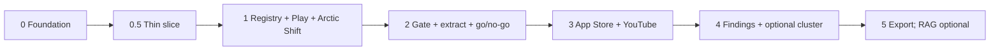

# Phase-wise implementation plan

This plan implements [`docs/Architecture.md`](Architecture.md) for Part 1 of [`docs/problemStatement.md`](problemStatement.md). Fetch lists stay in [`docs/sources.md`](sources.md).

Read the problem statement and `sources.md` first. Ask before changing working definitions, evidence standards, or constraints.

**Rule from the architecture:** each phase must remain useful if the next phase never ships. Do not start Photos product work. Do not treat sentiment as the primary output. Do not claim a success-rate impact. Stack: Python, **Groq API (LLM only)**, Streamlit, built in Cursor. **Embeddings: local BGE** (`BAAI/bge-small-en-v1.5`). Do **not** use OpenAI for chat or embeddings.

**Locked models** (also `config/models.yaml`):

| Job | Provider | Model |
| --- | --- | --- |
| Relevance gate, RER extract, synthesis | Groq | `GROQ_MODEL` in `env` (default `openai/gpt-oss-20b`; this is a Groq-hosted id, not the OpenAI API) |
| Text + structure embeddings, optional cluster/RAG | Local sentence-transformers | `BAAI/bge-small-en-v1.5` (`BGE_MODEL`) |

Never call the OpenAI API. Never use `text-embedding-3-*`, `text-embedding-ada-002`, or Groq `nomic-embed-text-*`.



**Reddit path (locked):** Arctic Shift public archive via `src/fetch_reddit_arctic.py`. Do **not** use PRAW, the official Reddit API, scraping of reddit.com, Apify, or PullPush. Keyword search **requires a subreddit** (no global Reddit search).

**Already done (2026-10-02):** `discover --test` (20 candidates); full `discover` (1777 unique); `collect` (577 posts, 4000 comments after comment-tree parser fix) in `data/raw/reddit_arctic.csv`.

**Provided JSON (include, filter, do not treat as a live Reddit API):**

| File | Use |
| --- | --- |
| `data/samples/reddit_sample.json` | **Schema only.** Fake example rows. Do **not** load into the evidence corpus. |
| `data/raw/reddit_apify.json` | Real dump (currently 5 threads: r/ask, r/TopMindsOfReddit, r/funComunitty, r/findareddit, r/reddithelp). **Import only relevant rows** (filter below). Drop all `author*` fields. |

**Relevance filter for that dump (and any later JSON you add):** keep a post/comment only if (a) it is about retrieving a photo/video/screenshot the user believes exists, with incomplete memory or an imprecise query, **and** (b) it is about **Google Photos** (or an allowed Photos-related subreddit: googlephotos, GooglePixel, AndroidQuestions), **and** (c) the subreddit is not medical/mental-health. Current dump: none of the five threads are r/googlephotos; expect most or all rows to be **dropped**. Rows that pass join Arctic Shift in the same common schema and are **deduped by `id`**.

**Project CSV (required after all sources are fetched):** one analysis file, not mixed into raw harvests:

- `data/processed/corpus_all.csv` — every harvested row, common schema, authors stripped, deduped by `id` (audit file).
- `data/processed/corpus_relevant.csv` — **the file this project uses.** Only `in_scope` incomplete-memory / Google Photos retrieval items (keep high/medium/low confidence; do not drop `low`). Written when Play + Reddit (+ App Store/YouTube if harvested) are in, then **refreshed** after the relevance gate and after any later harvest.

---

## How to use this plan

| Field | Meaning |
| --- | --- |
| **Goal** | Why this phase exists |
| **Jobs to land** | Names from Architecture §6.1 |
| **Build** | Concrete work |
| **Exit criteria** | Done means these checks pass |
| **Depends on** | Prior phase outputs |

Effort is relative (S / M / L) for a single implementer. Do not skip exit criteria to “save time”; later phases assume them.

**Streamlit (all phases):** **three pages**. Ask lives on **Evidence**, not a fourth page.

1. **Overview** — harvest health, in-scope counts, go/no-go, failure-type histogram (not average stars).
2. **Evidence** — explorer + audit (filters, quotes, ids, URLs, confidence) **and Ask the corpus** (BGE retrieve + Groq answer, citations only).
3. **Findings** — opportunity compare, severity with explained weights, export.

Ask is for **PM questions about this evidence** (incomplete-memory retrieval in public feedback). It is not a Google Photos help bot and not a find-my-photo chatbot. Unrelated questions must return “not enough evidence.”

---

## Fetching data (how URLs become files)

`docs/sources.md` is the allowed live list. Collectors write `data/raw/`. **Also merge** the relevant subset of JSON already in the repo. You do not need new Apify runs.

| Source | How we fetch | You supply |
| --- | --- | --- |
| Play Store listing | Python harvest of `com.google.android.apps.photos` (all stars) | Optional existing Play CSV |
| Reddit (primary) | Arctic Shift: `discover` → `selected=y` → `collect` | Nothing (no Reddit API) |
| Reddit (provided JSON) | Import `data/raw/reddit_apify.json`, keep only relevant Google Photos retrieval rows, strip authors, dedupe by id | File already in repo |
| App Store | Phase 3: public review RSS / scraper, app id `962194608` | Nothing |
| YouTube | Phase 3: comments API or skip if disabled | Optional YouTube API key |

When **all intended sources are fetched**, write **`data/processed/corpus_relevant.csv`**. Do not use raw Play/Reddit files as the analysis file after that.

**Arctic Shift facts (verified against the [API README](https://github.com/ArthurHeitmann/arctic_shift/blob/master/api/README.md)):**

- Base: `https://arctic-shift.photon-reddit.com` — no key, no login.
- Posts: `GET /api/posts/search` with `subreddit` + `query` (title and selftext), `sort=desc`, `limit` 1–100, `before` for extra pages.
- Comments: `GET /api/comments/tree` with `link_id=t3_<postid>`, `limit` (default 50).
- **`permalink` is not a valid `fields` value** (HTTP 400). URLs are built as `https://www.reddit.com/r/{subreddit}/comments/{id}/`.
- `/api/comments/tree` does not document `fields`; try then omit; strip any `author*` keys.
- Check `https://status.arctic-shift.photon-reddit.com` before a run. No uptime guarantee. Archive may lag recent days; scores/`num_comments` may be 0/1 until ~36 hours then backfill.
- Client: User-Agent `photos-research-script (student PM case study)`; 2–3s between requests; retries on 429/5xx/timeouts; honour `Retry-After` and `X-RateLimit-Reset`; stop after 5 consecutive failures; cache JSON under `data/raw/reddit_arctic/` (never overwrite).

**Mapping `sources.md` Reddit URLs → Arctic Shift:** global `reddit.com/search` URLs cannot be executed as global search. Use the **query text** against allowed subreddits only: `googlephotos`, `GooglePixel`, `AndroidQuestions`. Listed **thread** IDs in `sources.md` can be fetched with `comments/tree` even if they never appeared in keyword `discover`.

**Fetcher commands:**

```text
python src/fetch_reddit_arctic.py discover --test          # done
python src/fetch_reddit_arctic.py discover                 # full (wait for go)
python src/fetch_reddit_arctic.py discover --pages 2
# then mark selected=y on data/raw/reddit_candidates.csv
python src/fetch_reddit_arctic.py collect
python src/fetch_reddit_arctic.py collect --all-with-comments-over 5
```

Outputs: `data/raw/reddit_candidates.csv` (human review) → `data/raw/reddit_arctic.csv` (common schema + `parent_post_id`, `search_queries`). Filtered JSON rows merge into the same schema **before** `corpus_relevant.csv`.

---

## Phase 0 — Foundation

**Goal:** A runnable Python package, typed config, and empty stores so collectors and prompts have a contract.

**Jobs:** none yet (prep for `compile_sources`).

**Effort:** S–M

**Status:** Done (2026-10-02) — taxonomy, SQLite, Groq cache contract (`id` + `prompt_version` + model id), Streamlit three-page stub, CLI.

### Build

1. Repo layout: `config/`, `src/` (fetcher already here), `data/raw/`, `data/processed/`, `app/`, `tests/gold/`.
2. Local secrets: `.env.example` with **Groq** and optional YouTube placeholders. **No Reddit API key. No Apify key.** Keep real keys out of git (`env` / `.env`).
3. `config/taxonomy.yaml`: brief vocabularies only — memory anchors, forgotten anchors, retrieval behaviors, failure-type hypotheses, photo types, relevance, confidence high/medium/low (Architecture §5).
4. SQLite schema for harvest runs, utterances using the **common schema** (`source`, `id`, `date`, `text`, `url`, `rating`, `country_or_subreddit`, `type`), plus Reddit extras `parent_post_id`, `search_queries`. No plaintext usernames or author ids.
5. Groq client contract (from Phase 0.5): rate-limit handling, retries, **response cache keyed by item `id` + `prompt_version`** (+ model id). Groq is **LLM only**.
6. BGE embedder contract: `src/embed.py`, local `BAAI/bge-small-en-v1.5`, cache under `data/processed/embeddings/`. No OpenAI embeddings client.
7. Keep using `python src/fetch_reddit_arctic.py` for Reddit; add `import_provided_json` for `reddit_apify.json` (filter + strip authors). Later `python -m discovery` can wrap Play + Groq + `write_relevant_csv`.
8. `data/processed/` holds `corpus_all.csv` and `corpus_relevant.csv`.

### Exit criteria

- [x] Reddit fetcher exists; `data/raw/` gitignored; `requests` in requirements.
- [x] `taxonomy.yaml` is the only place enums are defined.
- [x] Empty DB can be created from a migration/script.
- [x] Common schema fields exist on the utterance table.
- [x] Processed tables have no plaintext username or author id.
- [x] Groq cache key is specified as `id` + `prompt_version` (+ model id).
- [x] Embedding provider is BGE local, not OpenAI.

**Depends on:** `Architecture.md`, `problemStatement.md`.

---

## Phase 0.5 — Thin slice

**Goal:** Prove relevance gate + extraction on ~100 real items **before** a full Groq pass.

**Jobs:** `gate_relevance`, `extract_rer` (slice only)

**Effort:** M

**Status:** Thin slice labeled 2026-10-02 (`data/processed/thin_slice_labeled.csv`). Groq model on this key: `openai/gpt-oss-20b` (`llama-3.3-70b-versatile` was not available).

### Build

1. **Inputs:**
   - Play Store CSV from a working harvest of the listing in `sources.md`, **or** skip Play and use Reddit-only if Play is not ready (note the bias).
   - Reddit: `data/raw/reddit_arctic.csv` after `collect`, **or** posts-only from `reddit_candidates.csv` if comments are not collected yet.
   - Provided JSON: any **relevant** rows from `data/raw/reddit_apify.json` (likely few or none). Never the fake `reddit_sample.json` items.
2. Map to the common schema. Never persist author fields (Arctic Shift cache already strips `author*`).
3. Sample **about 100 items** (mix Play + Reddit when both exist).
4. Two-stage relevance gate against the **incomplete-memory retrieval** definition; extract RERs on in-scope (+ small adjacent sample). Groq cache + rate limits.
5. Labeled CSV in `data/processed/`. Include `id`, source, relevance, confidence, failure type, anchors, behaviors, quotes, url.
6. Basic counts (in_scope / adjacent / out_of_scope; confidence; top failure types). Overview page or a printed table is enough.

### Exit criteria

- [x] ~100 items ran through gate + extraction; output CSV exists.
- [x] Basic counts are visible without opening a notebook.
- [ ] **I can hand-check 30 labeled items** (id, quote, relevance, confidence).
- [x] Quotes in the CSV are substrings of `text`.
- [x] Groq was not re-called for cached `(id, prompt_version)` pairs on a re-run.

**Depends on:** Phase 0 Groq client; Reddit candidates (test file exists) and/or Play harvest.

**PM value if you stop here:** checkable labeled slice before spending a full harvest on Groq.

---

## Phase 1 — Source registry, URL check, Play harvest, Arctic Shift Reddit

**Goal:** Compile `sources.md`, verify listing URLs, ingest Play, finish Reddit **discover → select → collect**.

**Jobs:** `compile_sources`, `harvest_play`, `discover` / `collect` (Arctic Shift), `import_provided_json`

**Effort:** M

### Build

1. **Compiler:** parse `docs/sources.md` into `config/sources.yaml` (play listing, app store listing, youtube videos, arctic-shift subreddits/queries, listed thread ids).
2. **Manual URL verification** of every listing/thread/video URL in `sources.md` (opens? on-topic?). Arctic Shift query strings do not need to “open” as search pages; record that they are executed via the archive instead.
3. **Play Store:** `com.google.android.apps.photos`; all star ratings; developer replies as context only; do not pre-filter to 1-star.
4. **Reddit discover (full):** when given the go — `discover` (optional `--pages` > 1). Default subreddits and queries are those in `sources.md` / the fetcher. Deduped candidates; `selected` column for the PM.
5. **PM selection:** mark `selected=y` on incomplete-memory-looking rows (or use `--all-with-comments-over N`). Keyword hits include promo/off-topic (seen in `--test`: PixHunt ads). That is expected; the gate and human `selected` filter them.
6. **Reddit collect:** comments/tree for selected posts; write `reddit_arctic.csv`. Optionally force-collect the **nine listed thread IDs** in `sources.md` via `link_id=t3_<id>` so those URLs are not dropped if keyword search missed them.
7. Skip medical / mental-health subreddits (not in the default list).
8. Exclude GooglePixel / AndroidQuestions rows that are not about Google Photos retrieval (lexical or later gate).
9. **Import provided JSON:** parse `data/raw/reddit_apify.json` (array of Reddit-style posts + nested comments). Map to common schema: `source=reddit`, `id`, `date` from `created_utc`, `text` = title+selftext or body, `url` from `permalink` if present else constructed, `rating` = score/ups, `country_or_subreddit`, `type`. Drop every `author*` field. Keep only rows that pass the **relevance filter** (Google Photos retrieval + incomplete memory). Deduplicate against Arctic Shift `id`s.
10. Do not ingest `data/samples/reddit_sample.json` into the corpus.

### Exit criteria

- [x] `discover --test` produced 20 unique candidates (2026-10-02).
- [x] Full `discover` run (1777 unique candidates).
- [x] `collect` written to `reddit_arctic.csv` (577 posts, 4000 comments).
- [x] `compile_sources` is deterministic (`config/sources.yaml`).
- [x] Play harvest loaded into the common schema (`data/raw/play_reviews.csv`, 200 reviews, all stars).
- [x] Provided JSON imported with relevance filter (0 kept; dump not Google Photos); sample JSON not in the corpus; authors stripped.
- [x] No plaintext author ids in CSVs or cache.
- [x] Harvest/import status recorded if Arctic Shift is down (`blocked`), not treated as “users have no Reddit problem.”

**Depends on:** Phase 0; explicit go for full discover/collect.

**PM value if you stop here:** Play + Reddit files in schema without a Reddit API.

---

## Phase 2 — Normalize, relevance gate, RER extraction, go/no-go

**Goal:** Gate + extract the **full** Play + `reddit_arctic.csv` corpus. Three Streamlit pages. Stop if in-scope volume is too small.

**Jobs:** `gate_relevance`, `extract_rer`

**Effort:** L

### Build

1. Normalize to common schema (`id` stable; `text` user-authored; Reddit `type` `reddit_post` / `reddit_comment`).
2. Relevance gate vs incomplete-memory definition → `in_scope` | `adjacent` | `out_of_scope` + confidence high/medium/low. Keep `low`; weight later.
3. RER extraction: memory/forgotten anchors, retrieval behaviors, **LLM-assigned** failure-type hypotheses, photo type. Quotes ⊆ `text`.
4. Groq rate limits, retries, cache `id` + `prompt_version`. LLM calls go to Groq only.
5. Gold sets: storage-only, crash, precise-query-failed, sync/deletion negatives; café/Goa and medicine/sick → `travel` / `medical`.
6. Streamlit: Overview, Evidence, Findings stub.
7. **Go / no-go:** unique in-scope `id` ≥ **~150** → go. Else collect more (more Play pages, `discover --pages`, listed threads, App Store) **before** Phase 4.
8. **Refresh `data/processed/corpus_relevant.csv`** after this gate (in_scope rows only, plus labeling columns). Also write/update `corpus_all.csv`.

### Exit criteria

- [x] Gold relevance and extraction tests pass.
- [x] Citation integrity: every `quotes[]` span ⊆ `text`.
- [x] Generic “search sucks” → `failure_type = other` + `confidence = low`.
- [x] Evidence page shows anchors + confidence.
- [x] Extraction schema and versioned prompts exist.
- [ ] **Go/no-go recorded.** Incomplete on 2026-10-02: Groq daily token cap (200000) exhausted. 9 in-scope so far; 1524 retrieval-hit rows still ungated. Resume with `python src/cli.py gate`. Not a no-go.
- [ ] `data/processed/corpus_relevant.csv` exists for the current corpus (partial in-scope file is written; refresh when the gate finishes). Play + Reddit are both in `corpus_all.csv`.

**Depends on:** Phase 1 utterances.

---

## Phase 3 — Remaining ingest adapters

**Goal:** App Store and YouTube. More Arctic Shift only if still under ~150 in-scope or Reddit is one-subreddit.

**Jobs:** `harvest_app_store`, `harvest_youtube`; optional extra `discover --pages`

**Effort:** M–L

### Build

1. **App Store:** app id `962194608`; `type=app_store_review`.
2. **YouTube:** four video ids in `sources.md`; comments optional; transcripts secondary.
3. **More Reddit if needed:** extra Arctic Shift pages or listed-thread collect. Not Apify. Not reddit.com scrape.
4. Re-run gate/extract on new rows (Groq cache). Re-check go/no-go.
5. **When all intended sources are fetched:** run `write_relevant_csv` so **`data/processed/corpus_relevant.csv` is the single analysis file.** Rebuild `corpus_all.csv` (union, deduped). Do not analyze from separate Play/Reddit/YouTube files after this point.

### Exit criteria

- [ ] Every registry row has a status (`ok`, `blocked`, `empty`, `error`).
- [ ] Overview counts **by source**, not success rates.
- [ ] Go-line held or blockers documented.
- [ ] **`data/processed/corpus_relevant.csv` is complete** for Play + Reddit + provided JSON + App Store + YouTube (a source may be empty if harvest was `blocked`/`empty`).
- [ ] Relevant CSV columns include at least: `source`, `id`, `date`, `text`, `url`, `rating`, `country_or_subreddit`, `type`, `parent_post_id`, `search_queries`, `relevance`, `confidence`, plus RER fields when extraction has run (`failure_type`, memory/forgotten anchors, retrieval behaviors, quotes).
- [ ] Out-of-scope rows are **not** in `corpus_relevant.csv` (they may remain in `corpus_all.csv` for audit).

**Depends on:** Phase 2 pipeline.

---

## Phase 4 — Findings, severity, optional clustering

**Goal:** Compare problem types using **Groq-assigned** failure types. Clustering is **optional validation** on **BGE** embeddings.

**Jobs:** `synthesize_opportunities`; `embed` (BGE); optional `cluster`

**Effort:** L

### Build

1. Aggregate RERs by LLM `failure_type` (Groq). Hypotheses in the brief are to test, extend, or reject.
2. Opportunity cards with `source_spread`, weak-signal flag (&lt; ~5 items), limitations, citations.
3. Severity formula; **never** a success-rate impact. Explain **each weight** on the Findings page. Sensitivity check (±25% or drop-one); record in the export. Weight by confidence.
4. **Embeddings (locked):** local BGE `BAAI/bge-small-en-v1.5` via `python src/cli.py embed`. Two vectors per item when RER fields exist: **text** (`text`) and **structure** (failure type + photo type + anchors + behaviors). Query vectors use the BGE search prefix. Do not use OpenAI embeddings. Do not use Groq nomic.
5. Optional clustering vs Groq labels only; do not overwrite labels without a human merge/split.
6. Findings page: compare two+ opportunities; still three pages total.

### Exit criteria

- [ ] Compare two opportunities with id + quote + counts + source_spread.
- [ ] No success-rate claim; sentiment is not the rank key.
- [ ] Weights explained; sensitivity recorded.
- [ ] Weak signal labeled; limitations on each card.
- [x] Embedding choice recorded: local BGE (`BAAI/bge-small-en-v1.5`), not OpenAI.
- [ ] Hypothesis add/reject recorded.

**Depends on:** Phase 2/3 RERs and **go** on ~150 in-scope items.

---

## Phase 5 — Export (mandatory); RAG optional

**Goal:** Markdown export that completes **Part 1 done when**. RAG is optional.

**Jobs:** export (mandatory); `ask` (on Evidence page)

**Effort:** S (export) / S–M (Ask already wired)

### Build

1. **Export (mandatory):** problem-type comparison (quotes, counts, source_spread, weak signal); prioritization (explained weights, sensitivity, confidence); limitations including:
   - frustrated users over-represented
   - Play Store storage/pricing dominate
   - few users describe what they remember
   - Arctic Shift: lag on very recent days; scores may backfill; no uptime guarantee; keyword search is subreddit-scoped (no global search); `permalink` field unsupported
   - `--test` showed off-topic keyword hits (e.g. gallery promo posts)
   - no success-rate impact claims
   - original URLs for every quote
2. **Ask the corpus (enabled):** BGE retrieve + Groq answer on the **Evidence** page (`src/ask.py`). Citations required. Unrelated / thin questions → not enough evidence. No fourth page. No OpenAI embeddings.
3. Pipeline diagram: Architecture §2 (or a copy in the export).

### Exit criteria

- [ ] Export complete per Part 1 done-when: pipeline diagram; schema and prompts; taxonomy; findings; prioritization; limitations.
- [x] Three Streamlit pages; Ask is a section on Evidence, not a fourth page.
- [x] Ask path exists (`python src/cli.py ask "…"` and Evidence page form).

**Depends on:** Phase 4 cards.

---

## After Phase 5 (not this plan)

Do **not** implement in these phases:

- Google Photos search / Lens / Memories product changes
- Indexing private photo libraries
- A consumer “find my photo” chatbot
- Claiming a success-rate impact
- OpenAI API (chat or embeddings)
- Groq embedding endpoints (`nomic-embed-*`)
- PRAW / Reddit API / reddit.com scrape / live Apify / PullPush (the provided JSON dump may be imported **after filtering**; that is not a live Apify harvest)
- n8n/Zapier as a second source of truth
- Making clustering mandatory (Ask on Evidence is in scope; cluster remains optional)
- Changing working definitions without asking

---

## Cross-phase engineering rules

| Rule | Practice |
| --- | --- |
| Sources of truth | Brief → taxonomy/prompts; URLs → `sources.md`; ask before changing definitions |
| URL check | Verify listing/thread/video URLs; Reddit **queries** run via Arctic Shift, not live search pages |
| Reddit | Arctic Shift is the live fetch; also merge **relevant** rows from provided JSON; never sample fakes; no Reddit API; no author fields |
| Project CSV | After all sources: `data/processed/corpus_relevant.csv` is the only file used for findings; `corpus_all.csv` is the full union for audit |
| Stack | Python, Groq LLM, local BGE embeddings, Streamlit, Cursor |
| Groq | LLM only: rate limits, retries, cache keyed by `id` + `prompt_version` |
| Embeddings | Local BGE `BAAI/bge-small-en-v1.5`; never OpenAI |
| Common schema | `source`, `id`, `date`, `text`, `url`, `rating`, `country_or_subreddit`, `type` |
| Privacy | Never write author names or ids |
| Sensitive subs | Exclude medical and mental-health subreddits |
| Volume | If in-scope unique ids &lt; ~150, collect more before clustering/ranking |
| Labels | LLM failure types primary; clustering optional validation |
| Evidence | Ids + quotes + counts + source_spread; &lt; ~5 = weak signal; no success-rate claims |
| UI | Three Streamlit pages unless a later phase justifies more |

---

## Suggested order inside a phase

1. Data contract / test (gold or schema).
2. Job implementation.
3. Wire into CLI.
4. Thin UI (stay within three pages).
5. Exit-criteria checklist.

---

## Phase checklist (roll-up)

| Phase | Primary output | Done when |
| --- | --- | --- |
| 0 | Package, taxonomy, Groq contract | Enums, privacy; fetcher already exists |
| 0.5 | ~100 labeled items | 30 items hand-checkable |
| 1 | Registry, Play, Arctic Shift collect, JSON import | Full discover + selected collect (after go); Play loaded; JSON filtered |
| 2 | Full RERs + three-page app | Gold sets + **go/no-go ~150**; relevant CSV refreshed |
| 3 | App Store / YouTube / more Reddit if needed | Status on every source; **`corpus_relevant.csv` final for fetch** |
| 4 | Opportunity compare + BGE embed | Explained weights + sensitivity; BGE not OpenAI |
| 5 | **Export mandatory** + Ask on Evidence | Part 1 done-when; Ask cites corpus only |

---

## Document control

| Doc | Role |
| --- | --- |
| [`problemStatement.md`](problemStatement.md) | Why, definitions, evidence standards, constraints, Part 1 done when |
| [`sources.md`](sources.md) | What to fetch, including Arctic Shift note |
| [`Architecture.md`](Architecture.md) | How the engine is built (may still mention older Reddit options) |
| [`implementation-plan.md`](implementation-plan.md) | Build order — **this file wins** on Reddit (Arctic Shift), Play-early, optional cluster/RAG, three Streamlit pages |
| [`edgecase.md`](edgecase.md) | Corner scenarios for every phase (use before / while implementing) |

Ask before changing working definitions. Next explicit go: full `discover` (not `--test`) and/or `collect`.
